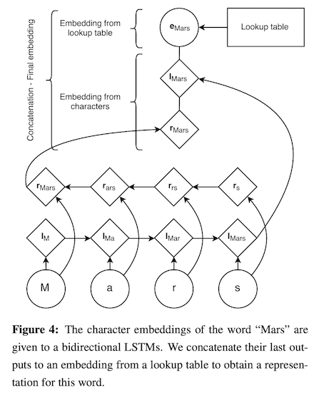

# Neural morphological tagging for Hebrew

This project presents my early efforts in neural morphological tagging for Modern Hebrew. Here, I define morphological tagging as the attempt to identify morphological properties of words. For instance, we may want a system to learn that היא ('she') is a `3rd-person, singular, feminine pronoun`, identifying the person, number, and gender properties of the word, as well as its part of speech. (In this sense, morphological tagging is the more informative cousin of part-of-speech tagging.) This type of morphological analysis is beneficial for processing morphologically rich languages like Modern Hebrew.

This README (`readme.md`) focuses on the model's architecture in Keras, whereas `readme.ipynb` demonstrates how to interact with the model implemented in `nn.py`. Note also that much of the code for this project resides in `data/`, which pre-processes and generates the gold data used below.

### The current classification task

All Modern Hebrew verbs, nouns, and adjectives are inflected for person (`1st`, `2nd`, `3rd`), number (`singular` and `plural`), and gender (`feminine` and `masculine`), such that they show agreement along these dimensions. Hebrew also inflects verbs for various tenses: `past`, `present`, `future`, `infinitive`, `imperative`, and `beinoni` ([which is similar to a participle](http://www.lrec-conf.org/proceedings/lrec2008/pdf/802_paper.pdf)). In addition, if a Hebrew noun is `definite`, all of its adjectival modifiers must also be marked as `definite`. Since these morphological properties surface ubiquitously in Hebrew, an ideal morphological tagger would detect all of them.

One option is to conceive of this task as a *multi-class* classification problem. In multi-class classification, the model attempts to label each word in an utterance with a single label from a set of 3+ labels. For instance, part-of-speech (POS) tagging is usually implemented as a multi-class classifier that predicts a single label for a word from classes like `noun`, `verb`, `adjective`, et cetera. In a neural POS tagger, the final layer is often a *softmax* layer that outputs the probability of the target word being an instance of each part of speech.

It is easy to conceive of doing morphological analysis in a similar manner, where we have labels like `def.sg.masc.noun` and `3rd.pl.masc.past.verb`. Each word would therefore have a single correct label and a final *softmax* layer would output the probability of each class being *that* label. However, there is a potential drawback to taking this approach with morphological tagging. Mainly, if we have two labels like `2nd.sg.fem.pronoun` and `2nd.pl.fem.pronoun`, nothing signals to the network that these two labels differ only with respect to number. Nothing explicitly tells the network that they are identical in their person, gender, and part of speech properties.

To address this issue, I have implemented the morphological tagger in a *multi-label* fashion, which allows for a word to receive multiple labels (e.g., `noun` *and* `1st-person`). The neural network tries to identify labels for six morphological properties in Hebrew: **part of speech**, **person**, **gender**, **number**, **tense**, and **definiteness**. To capture the many possible values for each property, the output for each word is a 38-dimensional vector, where each cell in the vector corresponds to a particular label:

The gold output vectors are "multi-hot" encoded, such that a cell is 1 if the label applies to the word and 0 if it doesn't. With this labeling scheme, the gold vectors for `2nd.sg.fem.pronoun` and `2nd.sg.fem.pronoun` differ only in terms of the two cells indicating number (in pink below); they are otherwise identical, reflecting their similar grammatical characteristics. Below, the top vector encodes `2nd.sg.fem.pronoun` and the bottom encodes `2nd.pl.fem.pronoun`:

Lastly, a multi-label configuration makes it easy to encode the morphology of words that take on multiple labels within a single morphological property. For instance, if the surface form of a verb can be used in the `1st-`, `2nd-`, *and* `3rd-person`, then the gold vector would simply mark 1's in all three of the cells for person.

### Model overview

Using Keras, I have haphazardly implemented a Long Short-Term Memory (LSTM) neural network for identifying the six Hebrew morphological properties stated above. The architecture for the input and hidden layers is largely inspired by [Lample et al.'s (2016)](https://www.aclweb.org/anthology/N16-1030) paper on character-based LSTMs for named entity recognition, as well as this [Keras tutorial](https://www.depends-on-the-definition.com/lstm-with-char-embeddings-for-ner/) on the same topic.

The network takes a sentence as its input and attempts to label each word in the sentence with a vector that encodes the values of the six morphological properties. The model takes advantage of both word embeddings and character embeddings. My hope is that the word embeddings will help the network learn how words behave in the context of other words (which largely reflects part of speech), while the character embeddings will help the network learn their internal morphological structure.

Each input sentence is represented by two input vectors. The first vector is the input to a word embedding layer. It assumes a finite dictionary *DW* that maps each unique word in the data to a unique index. Thus, if the sentence is of length $n$, then this vector represents the sentence as an *n*-length vector, where each word is represented by its index in *DW*.

Whereas the word embedding input is an *n*-dimensional vector, the character embedding input vector assumes a finite dictionary *DC* that maps each unique character in the data to a unique index. If the sentence is of length *n*, then the sentence is represented as an *n*-length vector *of vectors*: Each word is represented by a vector, in which each character in the word is represented by its index in *DC*.

The word embedding input vector enters the network by feeding into a word embedding layer. If the entire vocabulary is of size *V*, then the word embedding layer is a *V* x *dW* matrix of parameters, where *d^W* is the number of hidden units specified for the word embedding. This layer is created using `keras.layers.Embedding`.

Similarly, the character embedding input vector enters the network via a character embedding layer. If all of the words in the vocabulary draw exclusively from a set of *C* characters, then the character embedding layer is a *C* x *dC* matrix of parameters, where *dC* is the number of hidden units specified for the character embedding. This layer is also created using `keras.layers.Embedding`; however, it is wrapped in a `keras.layers.TimeDistributed` layer that processes the characters in the sentence one word at time (i.e., performing the character embeddings one word at a time).

The output of the character embedding layer is passed to a character-level bidirectional LSTM layer (`keras.layers.bidirectional` + `keras.layers.LSTM`) that is once again wrapped in a `TimeDistributed` layer to process the characters one word at a time. The output of this layer is then concatenated with the output of the word embedding layer to create a "full embedding". This concatenation is nicely depicted in a figure from [Lample et al. (2016)](https://www.aclweb.org/anthology/N16-1030), shown below. Afterwards, the full embedding is passed through another bidirectional LSTM.

The final layer of the network is a time-distributed `keras.layers.Dense` layer. For each word in the input sentence, it outputs the 38-dimensional vector that encodes the various morphological properties. 

Since the labels in the output vector are *not* mutually exclusive, it is less appropriate to use *softmax* in the final layer, as *softmax* pits labels against one another for probability mass. Instead, I use the *sigmoid* activation function, which computes a value for each cell in the output vector independently of all the other cells in the vector:

$$\text{Sigmoid activation function:}\quad f(x) = \dfrac{1}{1 + e^{-x}}$$

Likewise, during training, the model uses *binary cross entropy* as its loss function to prevent the assignment of one label from influencing the assignment of other labels. *Binary cross entropy* assumes each label has a binary distribution {*p*, 1-*p*}; therefore, it calculates the error for each label independently of the next, then sums over the results. Below, *yi* is the correct value for label *i* and *yi*-hat is the predicted value for that label.

$$\text{CE}_{\text{binary}} = -\sum_i \big( y_i \log(\hat{y}_i) + (1 - y_i)\log(1-\hat{y}_i)\big)$$

### The data

The data in this project draws from a subset of the Israeli [HaAretz](http://www.mila.cs.technion.ac.il/resources_corpora_haaretz.html) daily newspaper corpus, provided by [MILA](http://www.mila.cs.technion.ac.il/index.html). This subset is limited to 199 articles from 1990-1991 that were hand-annotated for morphological structure. From the 199 articles, I extracted 3,527 sentences, which altogether contained 20,806 unique word types across 65,471 tokens. I then performed an 80-10-10 split on the data, where 80% of the sentences were randomly selected for the training set (2,822 sentences), 10% for a development set (353 sentences), and 10% for the test set (352 sentences). For now, the morphological tagger assumes a closed vocabulary.

### Up next: Check out `readme.ipynb` :)

